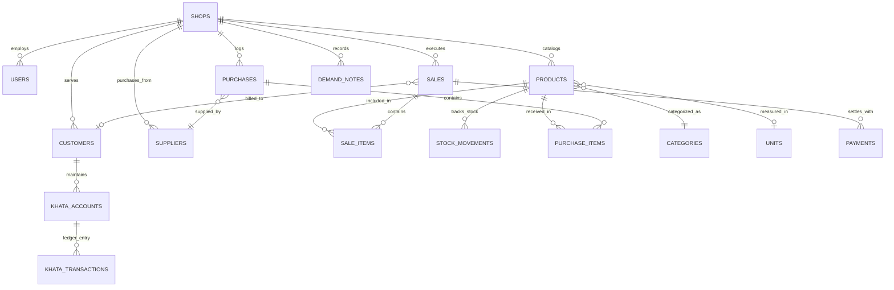
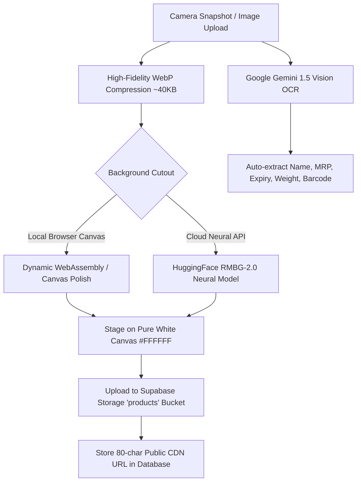
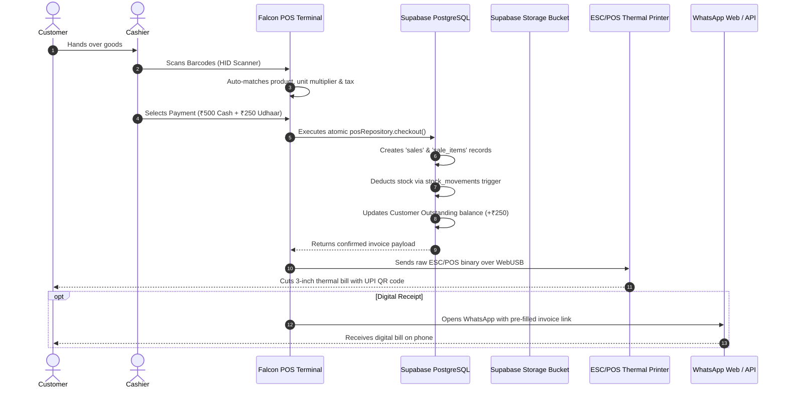

# 🦅 FALCON ERP: Complete System Architecture & Feature Manual
> **Comprehensive End-to-End Technical & Functional Guide**  
> *Generated for in-depth system study, onboarding, and architectural reference.*

---

## 📑 Table of Contents
1. [Executive Summary & System Identity](#1-executive-summary--system-identity)
2. [High-Level System Architecture](#2-high-level-system-architecture)
3. [Technology Stack Matrix](#3-technology-stack-matrix)
4. [Project Directory & Hierarchy Tree](#4-project-directory--hierarchy-tree)
5. [Database Schema & Entity Relationship Model](#5-database-schema--entity-relationship-model)
6. [Core Feature Deep Dive](#6-core-feature-deep-dive)
   - [6.1 High-Speed POS & Offline Billing Engine](#61-high-speed-pos--offline-billing-engine)
   - [6.2 Thermal Printing & ESC/POS Hardware Integration](#62-thermal-printing--escpos-hardware-integration)
   - [6.3 Falcon AI Center (Vision, Polish & Auto-Catalog)](#63-falcon-ai-center-vision-polish--auto-catalog)
   - [6.4 Real-Time Inventory & Stock Movement Triggers](#64-real-time-inventory--stock-movement-triggers)
   - [6.5 Khata (Credit Ledger & Udhaar Management)](#65-khata-credit-ledger--udhaar-management)
   - [6.6 Demand Pad & Supplier Purchase Workflow](#66-demand-pad--supplier-purchase-workflow)
   - [6.7 Online Storefront & Omni-Channel Ordering](#67-online-storefront--omni-channel-ordering)
   - [6.8 Super Admin, Multi-Tenancy & SaaS Lifecycle](#68-super-admin-multi-tenancy--saas-lifecycle)
   - [6.9 Automated Cloud Backup (Google Drive)](#69-automated-cloud-backup-google-drive)
7. [End-to-End Data Flow Diagrams](#7-end-to-end-data-flow-diagrams)
8. [Resource & Free-Tier Optimization Guide](#8-resource--free-tier-optimization-guide)

---

## 1. Executive Summary & System Identity

**Falcon ERP** is a state-of-the-art, multi-tenant Omnichannel Retail Management System designed specifically for modern grocery stores, supermarkets, pharmacies, and retail chains in India and emerging markets.

### Primary Pillars of Falcon:
1. **Zero-Latency Billing:** Desktop/Tablet POS designed for 10-second checkouts with barcode scanner and keyboard-first shortcuts (`F1`–`F12`).
2. **100% Offline-First POS:** Ability to scan, bill, and print thermal receipts even when internet connectivity drops, automatically syncing when restored.
3. **AI-Powered Cataloging:** Smartphone camera captures products; on-device/cloud AI removes messy backgrounds, centers on pure white canvases, compresses to WebP, and auto-fills product titles & barcodes.
4. **Integrated Khata (Ledger):** Tracks customer dues, partial payments, and sends 1-click WhatsApp payment reminders with dynamic UPI QR codes.
5. **Omni-Channel Storefront:** Every shop gets an instant online website (`/store`) where neighborhood customers browse inventory and place orders.

---

## 2. High-Level System Architecture

```mermaid
graph TB
    subgraph Client Layer ["Client Tier (Browser & PWA)"]
        POS[High-Speed POS UI]
        AdminUI[ERP Management Dashboard]
        Storefront[Online Customer Storefront]
        OfflineEngine[IndexedDB / Offline Engine]
    end

    subgraph Hardware Layer ["Hardware Interfacing"]
        USBPrinter[ESC/POS Thermal Printer (USB)]
        BTPrinter[Bluetooth Thermal Printer]
        Scanner[Barcode / QR Scanner (HID)]
    end

    subgraph Serverless Backend ["Next.js 14 Application Layer (Vercel)"]
        RouteHandlers[Next.js App Router API Routes]
        AuthGuard[Staff & Tenant Auth Middleware]
        DriveService[Google Drive Backup Service]
        RazorpayGateway[Razorpay UPI Payment Client]
    end

    subgraph Cloud Storage & AI ["AI & External Intelligence"]
        Gemini[Google Gemini 1.5 Vision AI]
        HF[HuggingFace RMBG Neural Models]
        OpenFood[OpenFoodFacts Barcode Database]
    end

    subgraph Data & Storage Layer ["Managed Database & Cloud (Supabase)"]
        Postgres[(PostgreSQL Relational Database)]
        StorageBucket[(Supabase Storage Bucket: 'products')]
        AuthEngine[Supabase JWT Auth Engine]
        DBTriggers[Postgres Auto Stock Deduct Triggers]
    end

    POS --> OfflineEngine
    POS --> USBPrinter
    POS --> BTPrinter
    POS --> Scanner

    POS --> RouteHandlers
    AdminUI --> RouteHandlers
    Storefront --> RouteHandlers

    RouteHandlers --> AuthGuard
    RouteHandlers --> Postgres
    RouteHandlers --> StorageBucket
    RouteHandlers --> DriveService
    RouteHandlers --> RazorpayGateway

    RouteHandlers --> Gemini
    RouteHandlers --> HF
    RouteHandlers --> OpenFood

    Postgres --> DBTriggers
```

---

## 3. Technology Stack Matrix

| Layer | Technologies Used | Purpose |
| :--- | :--- | :--- |
| **Framework** | **Next.js 14.2.23 (App Router)** | Full-stack serverless rendering, SSR & dynamic API routes |
| **Frontend UI** | **React 18, Tailwind CSS, Lucide Icons** | Ultra-responsive, dark/light modern UI with glassmorphism |
| **State Management** | **Zustand 5** | High-performance cart, tenant context, and active states |
| **Database & Auth** | **Supabase (PostgreSQL 17)** | Multi-tenant relational schema, foreign keys, row security |
| **File Storage** | **Supabase Storage (WebP CDN)** | High-resolution optimized product imagery with 1-year cache |
| **Hardware APIs** | **WebUSB, Web Bluetooth, Web Serial** | Direct browser-to-printer thermal receipt ESC/POS engine |
| **Offline Storage** | **Browser LocalStorage & IndexedDB** | Uninterrupted offline billing and transaction queuing |
| **AI Vision & NLP** | **Google Gemini 0.24, HuggingFace** | Product OCR, name translation, Hindi transliteration |
| **Payment Gateway** | **Razorpay Live SDK** | Dynamic UPI QR codes on receipts and web payments |
| **Cloud Backup** | **Google Drive REST API (Service SA)** | Nightly encrypted JSON backup archives |
| **Export/Reports** | **SheetJS (xlsx), HTML-to-Image** | Financial Excel exports and visual receipt generation |

---

## 4. Project Directory & Hierarchy Tree

```
e:/Falcon
├── 📁 app/                           # Next.js 14 App Router (Pages & APIs)
│   ├── 📁 (auth)/                    # Login, Register, Password Reset
│   ├── 📁 admin/                     # Super Admin SaaS Tenant Management
│   ├── 📁 ai-center/                 # AI Product Studio & Batch Enhancer
│   ├── 📁 api/                       # Serverless REST Backend Endpoints
│   │   ├── 📁 admin/                 # Tenant billing, shop extensions
│   │   ├── 📁 ai/                    # Image enhance, background removal, OCR
│   │   ├── 📁 backup/                # Google Drive export, restore, cron
│   │   ├── 📁 orders/                # Storefront order placement
│   │   ├── 📁 pos/                   # Barcode fast-lookup, checkout endpoints
│   │   └── 📁 products/              # Catalog management endpoints
│   ├── 📁 customers/                 # Customer CRM & phonebook
│   ├── 📁 dashboard/                 # Analytics, Sales charts, KPIs
│   ├── 📁 demand-pad/                # Smart procurement notebook
│   ├── 📁 inventory/                 # Stock levels, adjustments, batch tracking
│   ├── 📁 khata/                     # Customer ledger & credit management
│   ├── 📁 pay/                       # Customer web checkout portal
│   ├── 📁 pos/                       # High-speed point of sale terminal
│   ├── 📁 products/                  # Product catalog & barcodes
│   ├── 📁 purchases/                 # Supplier purchase invoices & stock-in
│   ├── 📁 reports/                   # P&L, GST reports, Excel exports
│   ├── 📁 sales/                     # Invoices, reprints, refund management
│   ├── 📁 settings/                  # Store info, thermal printer, backup config
│   ├── 📁 store/                     # Public customer e-commerce storefront
│   └── 📁 suppliers/                 # Vendor contact & due management
├── 📁 components/                    # Reusable React UI Components
│   ├── 📁 dashboard/                 # Metric widgets, revenue graphs
│   ├── 📁 khata/                     # Ledger dialogs, WhatsApp balance card
│   ├── 📁 pos/                       # Barcode camera, receipt preview, numpad
│   ├── 📁 products/                  # UnifiedAddProductModal, AI modal
│   └── 📁 store/                     # Public storefront product cards, cart
├── 📁 lib/                           # Core Business Logic & Drivers
│   ├── 📁 ai/                        # Gemini vision, sharp cropper, canvas polish
│   ├── 📁 backup/                    # Google Drive service account integration
│   ├── 📁 supabase/                  # Supabase clients & WebP storage helpers
│   ├── 📄 offline-pos.ts             # Offline billing queue & sync engine
│   ├── 📄 razorpay-client.ts         # UPI QR code & transaction generator
│   ├── 📄 thermal-printer.ts         # ESC/POS direct USB/BT printing driver
│   ├── 📄 transliterate.ts           # Real-time English to Hindi text engine
│   ├── 📄 units-pricing.ts           # Fractional pricing (kg, g, pc, box, dozen)
│   └── 📄 whatsapp-invoice.ts        # Direct WhatsApp invoice formatter
├── 📁 repositories/                  # Data Access Layer (Clean Architecture)
│   ├── 📄 customers.repo.ts          # Customer queries & balances
│   ├── 📄 demand-notes.repo.ts       # Procurement notebook data
│   ├── 📄 khata.repo.ts              # Ledger transactions & accounts
│   ├── 📄 pos.repo.ts                # Checkouts, sale items, receipts
│   ├── 📄 products.repo.ts           # Product CRUD & auto storage upload
│   └── 📄 purchases.repo.ts          # Supplier purchase orders & stock
└── 📁 types/                         # TypeScript interfaces & DB definitions
    └── 📄 database.ts                # Complete PostgreSQL table typings
```

---

## 5. Database Schema & Entity Relationship Model

The database is built on relational integrity with strict foreign key constraints and automatic PostgreSQL triggers.



### Table Definitions & Purpose:
1. **`shops`**: Stores tenant identity, currency, GSTIN, business type, and SaaS subscription status.
2. **`products`**: Contains barcode, SKU, name (English + Hindi), buying price, selling price, MRP, wholesale price, stock, and WebP image CDN URL.
3. **`sales` & `sale_items`**: Records every checkout, subtotal, discount, tax, itemized cost, and cashier ID.
4. **`payments`**: Handles split payments (Cash, UPI, Card, Udhaar) with reference numbers.
5. **`customers` & `khata_transactions`**: Maintains double-entry credit ledger, tracks running outstanding balances.
6. **`stock_movements`**: Immutable audit trail for every inventory increase (purchase/adjustment) or decrease (sale/damage).
7. **`demand_notes`**: Voice/text notes for items demanded by walk-in customers that are out of stock.

---

## 6. Core Feature Deep Dive

### 6.1 High-Speed POS & Offline Billing Engine
The POS interface ([app/pos/page.tsx](file:///e:/Falcon/app/pos/page.tsx)) is the heart of Falcon. It is built for retail environments where transaction speed is critical.

* **Keyboard-First Design:**
  * `F1` or `/`: Focus Barcode / Product Search input.
  * `F2`: Toggle Cash / UPI / Split Payment modes.
  * `F4`: Checkout & Instant Thermal Print.
  * `F8`: Hold Bill / Restore Suspended Bill.
* **Fractional & Multi-Unit Conversions ([lib/units-pricing.ts](file:///e:/Falcon/lib/units-pricing.ts)):**
  * Sell 250 grams of an item priced per kg.
  * Sell 1 single piece from a 12-piece Master Box; the system auto-calculates base units and adjusts stock accordingly.
* **Offline Fallback Architecture ([lib/offline-pos.ts](file:///e:/Falcon/lib/offline-pos.ts)):**
  ```mermaid
  sequenceDiagram
      autonumber
      actor Cashier
      participant POS as POS UI
      participant Engine as Offline Engine (LocalStorage/IndexedDB)
      participant Supabase as Supabase Cloud Database

      Cashier->>POS: Scan Barcode & Click Checkout
      alt Internet is Online
          POS->>Supabase: posRepository.checkout(payload)
          Supabase-->>POS: Returns Official Sale & Invoice #
      else Internet is Offline / Server Down
          POS->>Engine: saveOfflineBill(payload)
          Engine-->>POS: Generates Offline Bill # (OFF-XXXX)
          POS->>Cashier: Print Offline Thermal Receipt Instantly
      end
      Note over POS,Supabase: When Internet Reconnects (window.ononline)
      POS->>Engine: getPendingOfflineBills()
      Engine->>Supabase: Batch Sync Bills to Cloud
      Supabase-->>Engine: Mark Synced
  ```

---

### 6.2 Thermal Printing & ESC/POS Hardware Integration
Falcon contains a native, zero-dependency browser hardware driver ([lib/thermal-printer.ts](file:///e:/Falcon/lib/thermal-printer.ts)) supporting 58mm (2-inch) and 80mm (3-inch) receipts.

* **Connection Types:**
  1. **WebUSB:** Plug-and-play USB connection without installing Windows printer drivers.
  2. **Web Bluetooth:** Direct wireless pairing with mobile handheld thermal printers.
  3. **Web Serial:** RS232 / COM port printers.
  4. **System Dialog Fallback:** Standard browser printing.
* **Dynamic UPI QR Code on Bill:**
  * Generates an instant NPCI-compliant UPI payment QR code on the receipt footer (`upi://pay?pa=...&am=TOTAL&pn=SHOPNAME`).
  * Customer scans the printed receipt with PhonePe, GPay, or Paytm to pay instantly.
* **1-Click WhatsApp Invoice ([lib/whatsapp-invoice.ts](file:///e:/Falcon/lib/whatsapp-invoice.ts)):**
  * Formats a clean Unicode text invoice and triggers WhatsApp Web / Mobile directly to the customer's phone number with zero paper waste.

---

### 6.3 Falcon AI Center (Vision, Polish & Auto-Catalog)
Falcon integrates AI directly into product inventory management:



1. **AI Studio Polish:** Converts raw mobile photos into pure white `#FFFFFF` Amazon-grade catalog photos.
2. **Barcode Reverse Lookup:** When an unknown barcode is scanned, Falcon queries OpenFoodFacts and Gemini to populate the product name, brand, and category automatically.
3. **Hindi Transliteration ([lib/transliterate.ts](file:///e:/Falcon/lib/transliterate.ts)):** Typing `"chana dal"` automatically generates `"चना दाल"` for bilingual thermal bill printing.

---

### 6.4 Real-Time Inventory & Stock Movement Triggers
Inventory management is automated through PostgreSQL database triggers:

* **Automatic Sales Deductions:** When a sale is completed, a `stock_movements` record is created with `quantity_delta = -X`.
* **Atomic Trigger Execution:** Database triggers update `products.current_stock` atomically, preventing race conditions.
* **Low Stock Warnings:** Real-time badge indicators when `current_stock <= minimum_stock`.

---

### 6.5 Khata (Credit Ledger & Udhaar Management)
Allows shops to maintain customer credit ledgers digitally:

* **Instant Credit at POS:** Cashier can choose payment method `Udhaar/Credit`; the bill total is added to `customer.outstanding_balance`.
* **Double-Entry Ledger:** Every debit (credit purchase) and credit (cash/UPI payback) is recorded in `khata_transactions`.
* **WhatsApp Reminder:** Sends pre-formatted reminders:
  > *"Namaste Rahul ji, your outstanding balance at AGS Store is ₹1,450. Click here to pay via UPI: [Payment Link]"*

---

### 6.6 Demand Pad & Supplier Purchase Workflow
Solves the problem of lost sales when items are out of stock:

1. **Demand Pad ([app/demand-pad/page.tsx](file:///e:/Falcon/app/demand-pad/page.tsx)):** Staff can type or speak missing items demanded by customers.
2. **Supplier Mapping:** Demand notes group missing products by their respective vendors.
3. **Convert to Purchase:** 1-click converts demand notes into a formal Supplier Purchase Order, automatically increasing stock once inventory arrives.

---

### 6.7 Online Storefront & Omni-Channel Ordering
* **Showroom Catalog (`/store`):** Fast, mobile-first website for customers.
* **Integrated Cart & Checkout:** Customers can add items to cart and choose Home Delivery or Store Pickup.
* **Razorpay Payment Gateway (`/pay`):** Seamless UPI, Credit/Debit Card, and NetBanking payments.

---

### 6.8 Super Admin, Multi-Tenancy & SaaS Lifecycle
Falcon is built as a multi-tenant SaaS platform:

* **Tenant Isolation:** Every table features a `shop_id` foreign key.
* **Trial & Subscription Lifecycle ([lib/plans.ts](file:///e:/Falcon/lib/plans.ts)):**
  * `trial_active`: Full access during free trial period.
  * `trial_expired`: Redirects to `/trial-expired` with locked POS until subscription renewal.
  * `active`: Paid Pro / Enterprise tier.
* **Lead CRM (`app/admin/leads`):** Tracks incoming demo requests and customer inquiries.

---

### 6.9 Automated Cloud Backup (Google Drive)
Protects retail shops from device loss or accidental damage:

* **Automated Encrypted Export ([lib/backup/google-drive.ts](file:///e:/Falcon/lib/backup/google-drive.ts)):** Full database dump (products, customers, sales, inventory) exported as structured JSON.
* **Google Service Account:** Background upload directly to store owner's Google Drive folder without requiring manual user sign-in.
* **1-Click Restore:** Complete point-in-time recovery of all store data.

---

## 7. End-to-End Data Flow Diagrams

### Complete POS Transaction Lifecycle:



---

## 8. Resource & Free-Tier Optimization Guide

Falcon has been architected to run indefinitely within **Vercel** and **Supabase** Free Tiers:

| Platform | Resource | Free Quota | Falcon Allocation | Status |
| :--- | :--- | :--- | :--- | :--- |
| **Vercel** | Functions Storage | 10 GB | < 1 GB (with 7-day retention) | 🟢 100% Safe |
| **Vercel** | Deployment Storage | 10 GB | < 500 MB (clean public assets) | 🟢 100% Safe |
| **Vercel** | CPU Duration | 4 Hours / month | ~15 mins (Client-side AI offload) | 🟢 100% Safe |
| **Supabase** | Database Size | 500 MB | 15 MB (380+ products, 0 base64) | 🟢 97% Free |
| **Supabase** | File Storage Bucket | 1 GB | 309 KB (WebP ~38KB per image) | 🟢 99.9% Free |
| **Supabase** | Monthly Egress | 5 GB | ~200 MB (selective columns & pagination) | 🟢 96% Free |

### Best Practices to Maintain Free-Tier Health:
1. **Always Upload Images via Falcon UI:** The built-in compressor automatically produces 30-50KB WebP images, allowing **20,000+ images** within 1 GB.
2. **Do Not Store Raw Base64 in Database:** The system now automatically routes all image uploads to the `products` bucket.
3. **Preview Deployments:** Keep the 7-day retention policy active in Vercel to auto-clean old builds.

---

## 9. System Stability & Bug Fix History

| # | Component | Issue Resolved | Fix Applied |
| :--- | :--- | :--- | :--- |
| 1 | **Barcode Lookup** | PostgreSQL error `column "store_id" does not exist` | Corrected query column from `store_id` to `shop_id` in [`lib/ai/barcode-lookup.ts`](file:///e:/Falcon/lib/ai/barcode-lookup.ts). |
| 2 | **Offline POS Sync** | Potential race condition & duplicate bill creation | Added `isSyncInProgress` mutex lock to [`lib/offline-pos.ts`](file:///e:/Falcon/lib/offline-pos.ts). |
| 3 | **Thermal Receipt** | JSX unescaped entity `'` breaking builds | Escaped `Today&apos;s Due` in [`components/pos/ThermalReceipt.tsx`](file:///e:/Falcon/components/pos/ThermalReceipt.tsx). |
| 4 | **POS Cart Math** | Negative tax on high discounts & float precision | Clamped taxable amount with `Math.max(0, ...)` and 2-decimal rounding in [`app/pos/page.tsx`](file:///e:/Falcon/app/pos/page.tsx). |

---

*Manual maintained by the Falcon ERP Engineering Team.*
