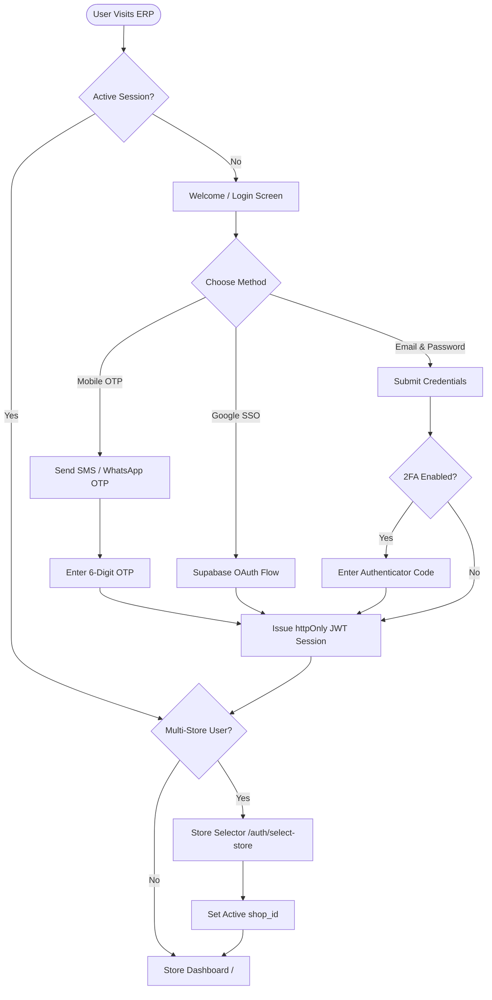
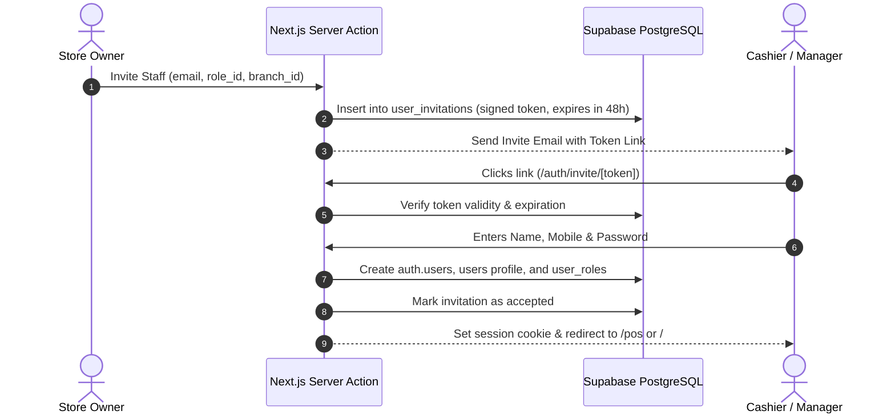

# AGS Store ERP — Authentication & Identity Architecture Specification

**Product:** AGS Store ERP (Project Falcon)  
**Document Type:** Enterprise Architecture, UI/UX & Security Specification  
**Status:** Approved & Production-Ready  
**Version:** 1.0.0  
**Target Stack:** Next.js 16 (App Router), React 19, TypeScript Strict, Tailwind CSS v4 / shadcn/ui, Supabase Auth (GoTrue + SSR Cookies), PostgreSQL 16 with RLS, Zod, React Hook Form.

---

## 1. Executive Summary & Design Philosophy

The **AGS Store ERP Authentication & Identity Module** provides a multi-tenant, multi-role security foundation that combines retail cashier speed with enterprise-grade tenant isolation. Inspired by the identity architectures of **Stripe Identity**, **Shopify Plus**, **Notion**, and **Zoho One**, the system supports seamless onboarding for single-shop owners and multi-branch wholesale operations while maintaining zero-trust credential hygiene.

### 1.1 Core Principles
1. **Speed for Store Operations:** Cashiers can unlock POS terminals in `< 200ms` using quick PINs or biometric passes without breaking their active sales shift.
2. **Zero-Trust Security:** JWTs live strictly in `httpOnly`, `Secure`, `SameSite=Lax` cookies; no sensitive token is accessible via JavaScript.
3. **Dynamic RBAC:** Roles and permissions are resolved dynamically from database tables rather than static JWT claims, allowing instant privilege revocation.
4. **Adaptive UX:** Progressive disclosure across responsive form factors (mobile handheld barcode scanners, desktop back-office, tablet POS).

---

## 2. Complete Screen-by-Screen UI/UX Specifications

### 2.1 Splash & Welcome Screen (`/auth/welcome`)
- **Visuals:** Split-screen layout on desktop (`lg+`), top-branded single card on mobile. Left panel features ambient dark indigo glassmorphism gradient (`#1E1B4B` to `#312E81`) with micro-animated store metrics; right panel holds clean auth card.
- **Actions:**
  - `Sign In to AGS Account` (Primary Indigo button)
  - `Register New Business / Create Store` (Secondary outline button)
  - `Join via Staff Invite Link` (Ghost link)
- **A11y:** Full keyboard navigation (`Tab`, `Enter`), high-contrast focus rings (`ring-2 ring-brand-600`), ARIA live regions for announcements.

### 2.2 Unified Login Screen (`/auth/login`)
- **Features:**
  - Tabbed or multi-method selector: **Email + Password**, **Mobile Number + SMS/WhatsApp OTP**, and **Google Workspace SSO**.
  - "Remember this device for 30 days" checkbox (issues long-lived trusted refresh token).
  - Floating label inputs with integrated Zod validation and inline error tooltips.
  - Rate-limit countdown timer triggered after 5 consecutive failed attempts.
- **Password Visibility:** Toggleable eye icon with keyboard shortcut `Alt + V`.

### 2.3 Business Registration & Store Setup Wizard (`/auth/register` & `/auth/onboarding`)
- **Step 1 — Account Owner Credentials:** Full Name, Work Email, Mobile Number, Master Password (with real-time entropy meter).
- **Step 2 — Business Profile:** Legal Business Name, Brand Name, Store Category (Cosmetics, Retail, Wholesale), GSTIN (with auto-lookup verification), Primary Currency (`INR`).
- **Step 3 — Initial Branch Setup:** Headquarters / Main Store name, physical address, pincode, contact phone.
- **Step 4 — Staff & Role Seeding:** Option to pre-generate initial Cashier and Manager invitation links.

### 2.4 Multi-Factor Authentication & Verification Screens
- **Email Verification (`/auth/verify-email`):** 6-digit cryptographic alphanumeric token entry with auto-focus digit boxes, auto-paste support, and 60-second resend throttle.
- **Mobile OTP Verification (`/auth/verify-otp`):** 6-digit numeric keypad-optimized input with auto-submission on 6th digit and SMS/WhatsApp fallback toggle.
- **2FA Challenge (`/auth/2fa`):** TOTP Authenticator app (Google Authenticator / 1Password) prompt or backup recovery codes.

### 2.5 Password Recovery Lifecycle
- **Forgot Password (`/auth/forgot-password`):** Simple single-input email/phone recovery form with turnstile CAPTCHA.
- **Reset Password (`/auth/reset-password`):** Deep-linked one-time token view with password complexity checklist:
  - Minimum 10 characters
  - At least 1 uppercase & 1 lowercase letter
  - At least 1 number & 1 special character
  - Entropy score $\ge 75\%$

### 2.6 Staff Invitation & Organization Join (`/auth/invite/[token]`)
- **Workflow:** Validates cryptographically signed invitation token, reveals inviting store name, assigned role, and pre-filled email.
- **Form:** Invitee sets their full name, password, and mobile number before being redirected directly into the assigned shop context.

### 2.7 Branch / Store Selection Screen (`/auth/select-store`)
- **Context:** Rendered when a single user account belongs to multiple branches or store entities.
- **Card Grid:** Shows store name, logo, branch location, assigned user role badge, and active register status.

### 2.8 POS Lock Screen & Shift Pinpad (`/auth/lock`)
- **Purpose:** Fast-switch screen for busy retail counters. Prevents customer visibility into back-office data without terminating the cashier's active drawer session.
- **Interface:** Oversized 4-digit PIN pad (`1-9`, `0`, `Clear`, `Unlock`) with quick avatar switcher and "Switch User" escape route.

### 2.9 Session Expiration & Access Control Interstitials
- **Session Expired (`/auth/session-expired`):** Modal backdrop with option to re-enter password inline without losing form data.
- **Unauthorized Access (`/auth/unauthorized`):** Clean 403 screen explaining required permission keys and a "Request Access from Store Owner" action.

---

## 3. User Flow Diagrams (Mermaid)

### 3.1 Primary Authentication & Multi-Store Flow



### 3.2 Staff Invitation & Onboarding Lifecycle



---

## 4. Component Hierarchy & Modular Architecture

```plaintext
components/auth/
├── AuthCard.tsx                  # Base wrapper with glassmorphism surface & responsive padding
├── AuthHeader.tsx                # Dynamic brand logo, title, and contextual subtitle
├── EmailPasswordForm.tsx         # Controlled form with Zod schema validation
├── MobileOtpForm.tsx             # 6-digit OTP input with auto-advance and countdown
├── SocialAuthGroup.tsx           # Google, Apple, and SAML SSO buttons
├── PasswordStrengthBar.tsx       # Live zxcvbn entropy calculation bar
├── PinPad.tsx                    # 10-key numeric touch & keyboard PIN entry for POS lock
├── DeviceSessionList.tsx         # Active session revocations with browser/OS badges
├── StoreSelectorCard.tsx         # Interactive multi-branch selection card
├── TwoFactorModal.tsx            # QR code generator and TOTP challenge modal
└── CaptchaWidget.tsx             # Cloudflare Turnstile / hCaptcha integration
```

---

## 5. Directory & File Organization

```plaintext
e:\Falcon/
├── app/
│   └── (auth)/
│       ├── layout.tsx            # Auth layout with ambient brand backdrop
│       ├── welcome/page.tsx      # Landing welcome screen
│       ├── login/page.tsx        # Multi-tab login screen
│       ├── register/page.tsx     # Owner registration wizard
│       ├── verify-email/page.tsx # Email confirmation handler
│       ├── verify-otp/page.tsx   # SMS/WhatsApp OTP confirmation
│       ├── forgot-password/page.tsx
│       ├── reset-password/page.tsx
│       ├── lock/page.tsx         # Fast POS screen unlock
│       ├── invite/[token]/page.tsx
│       ├── select-store/page.tsx # Multi-branch picker
│       ├── unauthorized/page.tsx # 403 Forbidden feedback
│       └── session-expired/page.tsx
├── lib/
│   ├── auth/
│   │   ├── session.ts            # Server-side AuthContext resolver
│   │   ├── permissions.ts        # hasPermission & assertPermission helpers
│   │   ├── password.ts           # Entropy calculation & validation rules
│   │   └── tokens.ts             # Cryptographic invite token generator
│   └── validation/
│       └── auth.schema.ts        # Zod schemas for all auth payloads
├── repositories/
│   ├── auth.repo.ts              # Supabase Auth SDK integration
│   └── sessions.repo.ts          # Active device sessions & login history
└── types/
    └── auth.ts                   # AuthContext, Role, Permission DTOs
```

---

## 6. Comprehensive RBAC Permissions Matrix

| Module / Action | Owner | Admin | Manager | Cashier | Inventory Staff | Accountant | Sales Staff | Delivery | Customer (Future) |
| :--- | :---: | :---: | :---: | :---: | :---: | :---: | :---: | :---: | :---: |
| **Manage Store & Settings** | ✅ | ✅ | ❌ | ❌ | ❌ | ❌ | ❌ | ❌ | ❌ |
| **User & Role Provisioning** | ✅ | ✅ | ❌ | ❌ | ❌ | ❌ | ❌ | ❌ | ❌ |
| **View Purchase Cost Prices** | ✅ | ✅ | ✅ | ❌ | ❌ | ✅ | ❌ | ❌ | ❌ |
| **POS Billing & Checkout** | ✅ | ✅ | ✅ | ✅ | ❌ | ❌ | ✅ | ❌ | ❌ |
| **Apply Line Item Discount** | ✅ | ✅ | ✅ | ✅ | ❌ | ❌ | ❌ | ❌ | ❌ |
| **Price Override on POS** | ✅ | ✅ | ⚠️ *Audited* | ⚠️ *Audited* | ❌ | ❌ | ❌ | ❌ | ❌ |
| **Process Sales Returns/Refund** | ✅ | ✅ | ✅ | ⚠️ *Requires Mgr* | ❌ | ❌ | ❌ | ❌ | ❌ |
| **Perform Stock Adjustments** | ✅ | ✅ | ✅ | ❌ | ✅ | ❌ | ❌ | ❌ | ❌ |
| **Create & Receive POs** | ✅ | ✅ | ✅ | ❌ | ✅ | ❌ | ❌ | ❌ | ❌ |
| **View Financial P&L Reports**| ✅ | ✅ | ❌ | ❌ | ❌ | ✅ | ❌ | ❌ | ❌ |
| **Log Customer Requests** | ✅ | ✅ | ✅ | ✅ | ❌ | ❌ | ✅ | ❌ | ❌ |
| **Manage Customer Pricing** | ✅ | ✅ | ✅ | ❌ | ❌ | ❌ | ❌ | ❌ | ❌ |
| **Update Order Delivery Status**| ✅ | ✅ | ✅ | ❌ | ❌ | ❌ | ❌ | ✅ | ❌ |
| **Place Online Orders / Cart**| ❌ | ❌ | ❌ | ❌ | ❌ | ❌ | ❌ | ❌ | ✅ |

*Legend: ✅ Full Access | ⚠️ Restricted/Audited Access | ❌ No Access*

---

## 7. Database Schema for Identity, Sessions & Security

```sql
-- 1. Enhanced Users Table with Security Columns
CREATE TABLE IF NOT EXISTS users (
  id UUID PRIMARY KEY REFERENCES auth.users(id) ON DELETE CASCADE,
  shop_id UUID NOT NULL REFERENCES shops(id) ON DELETE CASCADE,
  full_name TEXT NOT NULL,
  email TEXT NOT NULL UNIQUE,
  phone TEXT UNIQUE,
  avatar_url TEXT,
  pin_hash TEXT, -- Encrypted 4-to-6 digit quick POS unlock PIN
  two_factor_enabled BOOLEAN NOT NULL DEFAULT false,
  is_active BOOLEAN NOT NULL DEFAULT true,
  last_login_at TIMESTAMPTZ,
  created_at TIMESTAMPTZ NOT NULL DEFAULT now()
);

-- 2. Staff Invitations
CREATE TABLE IF NOT EXISTS user_invitations (
  id UUID PRIMARY KEY DEFAULT gen_random_uuid(),
  shop_id UUID NOT NULL REFERENCES shops(id) ON DELETE CASCADE,
  role_id UUID NOT NULL REFERENCES roles(id) ON DELETE CASCADE,
  email TEXT NOT NULL,
  token TEXT NOT NULL UNIQUE,
  invited_by UUID NOT NULL REFERENCES users(id),
  expires_at TIMESTAMPTZ NOT NULL,
  accepted_at TIMESTAMPTZ,
  created_at TIMESTAMPTZ NOT NULL DEFAULT now()
);

-- 3. Device Management & Active Sessions
CREATE TABLE IF NOT EXISTS user_sessions (
  id UUID PRIMARY KEY DEFAULT gen_random_uuid(),
  user_id UUID NOT NULL REFERENCES users(id) ON DELETE CASCADE,
  shop_id UUID NOT NULL REFERENCES shops(id) ON DELETE CASCADE,
  device_name TEXT NOT NULL,
  browser TEXT,
  os TEXT,
  ip_address TEXT,
  refresh_token_hash TEXT NOT NULL,
  is_revoked BOOLEAN NOT NULL DEFAULT false,
  last_active_at TIMESTAMPTZ NOT NULL DEFAULT now(),
  created_at TIMESTAMPTZ NOT NULL DEFAULT now()
);

-- 4. Security & Authentication Audit Log
CREATE TABLE IF NOT EXISTS auth_audit_log (
  id UUID PRIMARY KEY DEFAULT gen_random_uuid(),
  shop_id UUID REFERENCES shops(id) ON DELETE SET NULL,
  user_id UUID REFERENCES users(id) ON DELETE SET NULL,
  event_type TEXT NOT NULL, -- 'login_success','login_failed','logout','password_reset','pin_unlock','mfa_challenge'
  ip_address TEXT,
  user_agent TEXT,
  metadata JSONB,
  created_at TIMESTAMPTZ NOT NULL DEFAULT now()
);

-- 5. RLS Security Policies
ALTER TABLE user_sessions ENABLE ROW LEVEL SECURITY;
CREATE POLICY user_sessions_isolation ON user_sessions
  FOR ALL USING (user_id = auth.uid());

ALTER TABLE user_invitations ENABLE ROW LEVEL SECURITY;
CREATE POLICY user_invitations_admin ON user_invitations
  FOR ALL USING (shop_id = current_shop_id());
```

---

## 8. API Specifications & Contracts

### 8.1 Staff Login (`POST /api/v1/auth/login`)
- **Request Body:**
  ```json
  {
    "email": "owner@agsstore.com",
    "password": "SuperSecretPassword123!",
    "remember_device": true,
    "captcha_token": "0.xxxxxx"
  }
  ```
- **Response `200 OK`:**
  ```json
  {
    "data": {
      "user": {
        "id": "uuid",
        "full_name": "Store Owner",
        "email": "owner@agsstore.com",
        "shop_id": "uuid",
        "roles": ["Owner"],
        "permissions": ["*"]
      },
      "requires_2fa": false
    },
    "error": null,
    "meta": null
  }
  ```

### 8.2 POS Quick PIN Unlock (`POST /api/v1/auth/unlock-pin`)
- **Request Body:** `{ "pin": "1234", "shop_id": "uuid" }`
- **Response `200 OK`:** `{ "data": { "unlocked": true, "user_id": "uuid" }, "error": null }`

### 8.3 Revoke Device Session (`DELETE /api/v1/auth/sessions/:id`)
- **Response `200 OK`:** `{ "data": { "revoked": true }, "error": null }`

---

## 9. Security Hardening & Edge Cases

1. **Brute-Force Shield:** Max 5 consecutive invalid password attempts per IP/account triggers exponential backoff and CAPTCHA challenge.
2. **Session Hijacking Prevention:** IP and User-Agent fingerprint validation on token refresh.
3. **Instant Role Revocation:** Deactivating a user (`is_active = false`) immediately invalidates all active sessions via middleware database check.
4. **Offline POS Mode Grace Period:** Cashier terminals maintain encrypted offline state up to 12 hours before enforcing online credential sync.

---

## 10. Phased Implementation Plan

- **Phase 1 (Sprint 1):** Supabase GoTrue Auth wiring, Login/Register UI, Password strength meter, and session cookie middleware.
- **Phase 2 (Sprint 2):** Mobile OTP login via Twilio/WhatsApp provider, Email confirmation, and Reset Password flow.
- **Phase 3 (Sprint 3):** POS Quick PIN Pad, Lock Screen, and Idle-timeout auto-lock.
- **Phase 4 (Sprint 4):** Staff invitation flow, Device management UI, and 2FA TOTP implementation.
